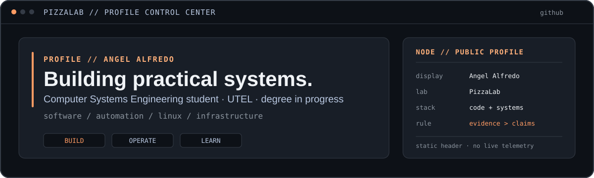

<p align="center">
  
</p>

<p align="center">
  <a href="https://alpizars2005-oss.github.io/aalfredo-dev/"><strong>Portfolio</strong></a>
  &nbsp;·&nbsp;
  <a href="https://github.com/alpizars2005-oss?tab=repositories"><strong>Repositories</strong></a>
  &nbsp;·&nbsp;
  <a href="https://github.com/alpizars2005-oss/job-search-mx-assistant"><strong>Current public project</strong></a>
</p>

---

## `PROFILE // ABOUT`

I'm **Angel Alfredo**, a Computer Systems Engineering student at **UTEL Universidad** — degree in progress.

I build practical software and automation, work with Linux and infrastructure in my homelab, and document projects with the same rule I use in PizzaLab: keep the architecture understandable, the boundaries explicit, and the claims tied to evidence.

My current direction sits between **software**, **systems / technical support**, and **infrastructure**. I also use coursework and labs to keep developing in QA, data, networking, and cybersecurity without presenting those learning areas as professional specializations.

> **Working style:** small dependencies, reproducible checks, privacy-aware design, useful rollback paths, and documentation that says what is actually implemented.

---

## `SYSTEMS // STACK`

| Layer | Tools I use |
| --- | --- |
| **Programming** | Python · JavaScript · HTML/CSS |
| **Automation & tooling** | Git · GitHub · GitHub Actions · shell / scripting |
| **Systems** | Linux · Proxmox · Docker · networking |
| **Data & local apps** | SQLite · JSON/CSV workflows · REST APIs |
| **Project-specific** | AutoHotkey v2 · Windows automation |

I keep this list intentionally small. A technology appears here because it is used in public projects, documented portfolio work, or the private PizzaLab infrastructure — not because I tried it once.

---

## `PROJECTS // SELECTED`

| Project | Boundary | What it represents |
| --- | --- | --- |
| **[Job Search Assistant](https://github.com/alpizars2005-oss/job-search-mx-assistant)** | **Public · owned** | Python desktop/CLI workspace with SQLite, bilingual workflows, fit analysis, exports, privacy boundaries, tests, and Windows/Linux support. |
| **[Mochi Mochi](https://github.com/alpizars2005-oss/Mochi-Mochi)** | **Public · owned** | Dependency-light HTML/CSS/JavaScript application for menu, ordering, browser-local sales tracking, and CSV/Excel export. |
| **[Alpizers](https://github.com/alpizars2005-oss/Media-Manager-Releases)** | **Private source · public releases** | Windows media/download application. Development stays private; releases, integrity guidance, and distribution history are public. |
| **[Ultimate Macro](https://github.com/UltimateMacro/Ultimate-Macro-New-Era)** | **Community project · contributor** | Contributions to an existing open-source/community project, kept separate from project ownership. [Merged upstream PRs](https://github.com/UltimateMacro/Ultimate-Macro-New-Era/pulls?q=is%3Apr+author%3Aalpizars2005-oss+is%3Amerged) and a [public remote-control extension](https://github.com/alpizars2005-oss/ultimate-macro-remote) provide the evidence trail. |
| **[UCAMP Projects](https://github.com/alpizars2005-oss/Ucamp-Projects)** | **Public · coursework** | Learning history across Python fundamentals, validation, APIs, files, tests, Git/GitHub, visualization, and Scrum. |

More context and project evidence live in my **[portfolio](https://alpizars2005-oss.github.io/aalfredo-dev/)**.

---

## `LAB // PIZZALAB`

**PizzaLab** is my private infrastructure homelab and the visual language behind this profile.

It is built around **Proxmox and Linux** and gives me a place to work hands-on with virtualization, containers, networking, storage, remote administration, service isolation, monitoring, and recovery-oriented thinking.

The implementation repository, infrastructure inventory, host details, and access paths stay private by design. Public descriptions focus on architecture and verified capabilities rather than exposing operational details or pretending this README is a live dashboard.

```text
PizzaLab
├─ virtualization      Proxmox
├─ systems             Linux
├─ services            containers + local applications
├─ network             segmented / remote-access aware
└─ principle           document what is real, keep sensitive details private
```

---

## `LEARNING // EDUCATION`

**Computer Systems Engineering — UTEL Universidad**  
*Degree in progress.*

Current public learning evidence includes:

- **[Google IT Automation with Python — practice repository](https://github.com/alpizars2005-oss/it-cert-automation-practice)** — scripting, Git, service automation, and small lab artifacts.
- **[UCAMP Projects](https://github.com/alpizars2005-oss/Ucamp-Projects)** — Python, APIs, validation, files, testing, visualization, and Scrum.
- Ongoing study around **QA, data, networking, cybersecurity, and infrastructure**, represented as learning areas unless a project provides stronger evidence.

---

## `LINKS // CONTACT`

- **Portfolio:** [alpizars2005-oss.github.io/aalfredo-dev](https://alpizars2005-oss.github.io/aalfredo-dev/)
- **GitHub:** [@alpizars2005-oss](https://github.com/alpizars2005-oss)
- **Public work:** [repositories](https://github.com/alpizars2005-oss?tab=repositories)

For current CV and professional/contact links, use the portfolio above so this profile README does not duplicate or expose more personal information than necessary.

---

<p align="center">
  <sub><code>PizzaLab // build carefully · document clearly · evidence &gt; claims</code></sub>
</p>
